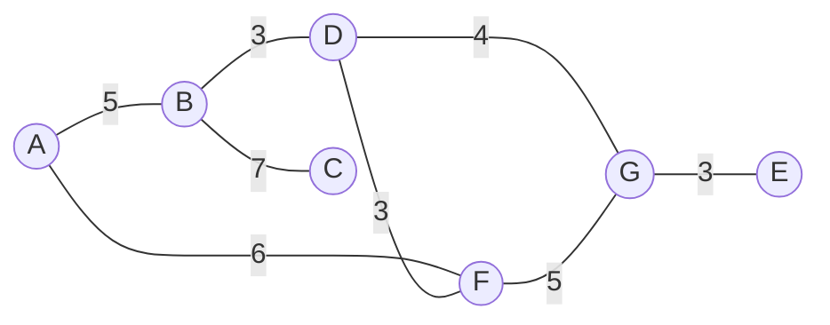

# Problemi di "search"

Un problema di *ricerca* ("search") è un tipo particolare di **inferenza**.


> ##### Inferenza: approccio top-down
> ###### Costruzione del modello
> - La costruzione del modello è la parte semplice di questo approccio e consiste nella descrizione delle dinamiche dell'*ambiente* e come queste cambiano a seconda delle varie azioni compiute dall'*agente*.
>
> ###### Utilizzo del modello
>
> - L'utilizzo del modello è la parte complessa dell'approccio e consiste nel calcolo della soluzione attraverso la manipolazione del modello, **ricerca** nello spazio delle soluzioni possibili;
> - L'*agente* deve cercare, ragionare, esplorare direzioni diverse.
>
> ```mermaid
> flowchart LR;
> 	p(Problema) --> cm(Costruzione del modello)
> 	cm-->um(Utilizzo del modello)
> 	um-->s(Soluzione)
> ```


La *ricerca* è un metodo formale per costruire una *sequenza di azioni* (piano) che *l'agente* potrebbe eseguire, esplorando e valutando molteplici possibilità (considerando le conseguenze di ogni possibile azione sugli stati del problema), per portare il mondo da uno stato iniziale a uno stato di goal.

- Premessa, considereremo lo scenario più semplice: singolo agente, osservabilità e determinismo.


## Spazio degli stati

- $S = \{s_1, s_2, \dots\}$ insieme o **spazio degli stati**, assumiamo uno spazio degli stati finito

- $s_I \in S$ è lo stato **iniziale**, descrive la situazione di partenza in cui si trovano *agente* e *ambiente*
- $s_G \in S$ è lo stato di **goal**, descrive la situazione in cui l'*agente* vuole trovarsi

- Per ogni stato, vi è un insieme finito di azioni che possono essere intraprese dall'*agente* da quello stato $A(s_i) = \{a, b, c, \dots\}$
- Modello di transizione $f$: dato uno stato di partenza $s_i$ e un'azione $a \in A(s_i)$, indica uno stato di arrivo $f(s_i, a)$: rappresenta la conseguenza dello svolgere l'azione $a$ nello stato $s_i$ 

- Una transizione causata da una azione può generare un **costo additivo** $c(s_i, a, f(s_i, a))$

Il tutto può essere mappato in un grafo in cui gli stati sono i nodi e le azioni sono gli archi.


## Specificare il problema

Un problema di search può essere specificato secondo due approcci: 

- specifico in modo **esplicito** lo spazio degli stati, fornendo il grafo in modo completo, specificando tutti gli stati e le transizioni possibili;
- specifico lo stato iniziale e la funzione di transizione in una forma compatta (ad esempio, un insieme di regole con cui generare gli stati successivi a partire da quelli correnti), modo **implicito**.

Il problema può essere identificato secondo due (tre) classi di problemi:

| **Fattibilità**                                              | **Approssimazione** | **Ottimizzazione**                                           |
| ------------------------------------------------------------ | ------------------- | ------------------------------------------------------------ |
| Esiste un percorso per il goal?                              | "Una via di mezzo"  | Quale è il percorso per il goal con il costo minore?         |
| Devo costruire una sequenza di azioni che mi porti da $s_I$ fino al goal | "Una via di mezzo"  | Devo costruire **la miglior** sequenza di azioni che mi porti da $s_I$ fino al goal. |


## Obiettivi della ricerca

Un algoritmo di ricerca **esplora il grafo degli stati fino a quando non trova la soluzione desiderata**.

L'obiettivo della ricerca cambia a seconda della classe del problema:

- nella versione di **fattibilità** quando viene visitato un nodo di goal viene restituito il percorso che ha portato a quel nodo;
- nella versione di **ottimizzazione** quando viene visitato un nodo di goal viene restituito il percorso con il costo minore che ha portato a quel nodo.

Si evince che l'algoritmo non deve solamente visitare un nodo di goal, ma deve tenere traccia della sua ricerca: tale traccia può essere mappata di un sotto-grafo di G, detto **albero di ricerca**.


## Qualità di un algoritmo di ricerca

- **Correttezza**
  *"L'algoritmo dice che c'è una soluzione. È vero? La soluzione che l'algoritmo ha calcolato conduce davvero ad un goal?"*

  Garanzia che se l'algoritmo restituisce una soluzione, questa soluzione è conforme alle caratteristiche specificate nella formulazione del problema.

- **Completezza (Sistematicità)**
  *"L'algoritmo termina sempre? E se dice che non ci sono soluzioni è vero?"*

  Garanzia che se una soluzione esiste allora l'algoritmo la trova **sempre**.
  La completezza di solito si dimostra facendo vedere che la ricerca nello spazio degli stati è in grado di visitare tutti gli stai possibili, a patto di concedere un tempo arbitrariamente lungo.

  Se lo spazio degli stati è infinito, possiamo chiederci se la ricerca è **sistematica**:

  - se la risposta è *si* l'algoritmo deve terminare
  - se la risposta è *no*, va bene se non termina ma tutti gli stati raggiungibili devono essere visitati nel limite: man mano che il tempo va all'infinito, tutti gli stati vengono visitati (vale sotto l'ipotesi di spazio degli stati numerabile)

- Complessità in termini di **spazio** e **tempo**

  - *Complessità spaziale*: come cresce la quantità di memoria richiesta dall'algoritmo
  - *Complessità temporale*: come cresce il tempo richiesto (numero di operazioni) dall'algoritmo


I diversi algoritmi di ricerca sono caratterizzati dalla risposta che forniscono alla seguente domanda: *Dato quello che ho ispezionato fino ad ora, dove proseguire con la ricerca?*


## Esempio di riferimento - "Running example"

- $S=\{A, B, C, D, E, F, G\}$
- $s_I \leftarrow A$
- $s_G \leftarrow E$
- Gli archi sono simmetrici, su ognuno non è riportato il nome ma il *costo* dell'azione


