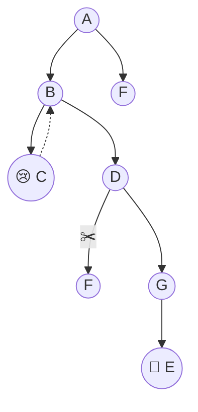
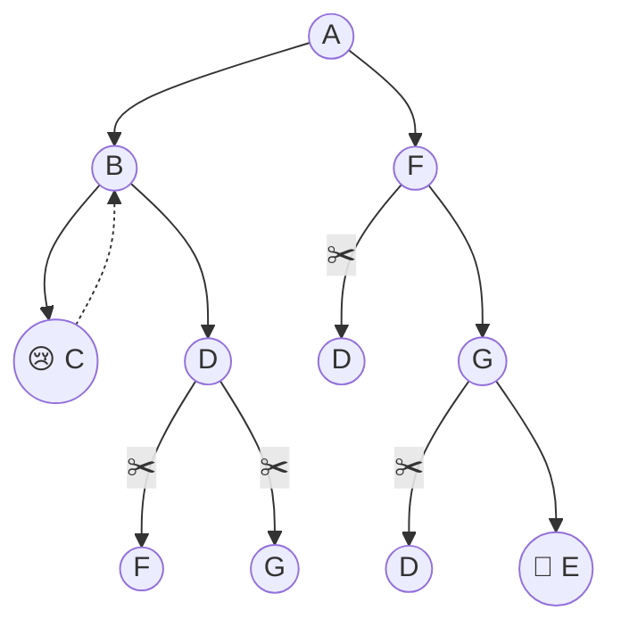
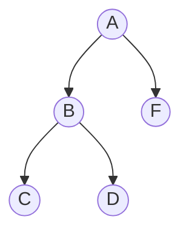
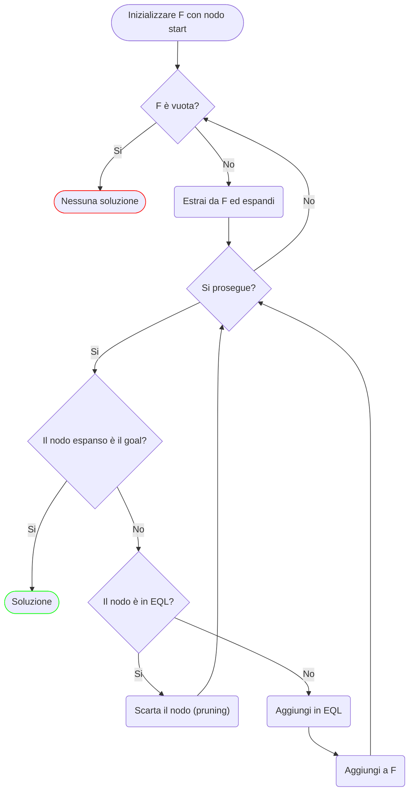

# DFS e BFS

**DFS** (*Depth-First Search*) e **BFS** (*Breadth-First Search*) sono due algoritmi di ricerca su alberi e grafi.

## Proprietà comuni

- I loop sullo stesso ramo vengono evitati;
- In caso di pareggio tra nodi alla stessa profondità, viene adottato l'ordine lessicografico (qualsiasi altro criterio va bene);
- **Backtracking**: riconsiderare decisioni valutate in precedenza e ripartire su un percorso alternativo;

Con queste due proprietà si applicano delle buone norme di efficienza, ma non bastano! Infatti evitare i loop impedisce di visitare nodi già visti solo lungo lo stesso ramo. L'idea è quindi quella di scartare un nodo appena generato se già presente da qualche parte nell'albero.

- **Lista degli accodamenti** (*Enqueued list*, **EQL**): se un nodo è già presente nella lista lo scarto, "potando" un ramo dell'albero, questa operazione è detta ***pruning***, perchè evito di generare una parte dell'albero di ricerca;

## Depth-First Search (DFS)

La ricerca in profondità sceglie il nodo più profondo (più in basso) non ancora esplorato nell'albero (grafo) di ricerca.

- La DFS con rimozione dei loop, backtracking e EQL è **corretta** e **completa**.

> Chiamiamo $b$ il massimo *branching factor*, cioè il massimo numero di azioni disponibili in uno stato (numero di nodi uscenti)
>
> Chiamiamo $d$ la profondità massima di una soluzione, cioè il massimo numero di azioni in un percorso dallo stato iniziale al goal

- Complessità spaziale: $O(d)$
- Complessità temporale: $1 + b + b^2 + b^3 + \dots + b^d = O(b^d)$

 ### Esecuzione sul running example

L'*EQL* evolve nel seguente modo:

1. $EQL =\{A\}$
2. $EQL = \{A, B, F\}$
3. $EQL = \{A, B, F, C, D\}$
4. $EQL = \{A, B, F, C, D, G\}$
5. $EQL = \{A, B, F, C, D, G, E\}$

Albero di ricerca:

Risultato: $A \rightarrow B \rightarrow D \rightarrow G \rightarrow E$

## Breadth-First Search (BFS)

La ricerca in ampiezza sceglie il nodo meno profondo (più in alto) non ancora esplorato, procede quindi per livelli di profondità.

Rispetto alla DFS ha un comportamento più conservativo: DFS punta tutto su un percorso, mentre BFS esplora prima tutti i nodi.

- Anche BFS con rimozione dei loop, backtracking e EQL è **corretta** e **completa**.

> Chiamiamo $q$ la profondità minima a cui sta una soluzione (in generale $q \leq d$)

- Complessità spaziale: $O(b^q)$
- Complessità temporale: $O(b^q)$

### Esecuzione sul running example

L'*EQL* evolve nel seguente modo:

1. $EQL =\{A\}$
2. $EQL = \{A, B, F\}$
3. $EQL = \{A, B, F, C, D\}$
4. $EQL = \{A, B, F, C, D, G\}$
5. $EQL = \{A, B, F, C, D, G, E\}$

Albero di ricerca:

Risultato: $A \rightarrow F \rightarrow G \rightarrow E$

## Implementazione

Entrambi gli algoritmi si basano su due strutture dati:

- **EQL** (*Enqueued List*), la lista degli accodamenti, i nodi che sono in questa lista compaiono già da qualche parte sull'albero di ricerca
- **F** (**la Frontiera**, *frontier*), contiene quei nodi dell'albero tra cui scegliamo per procedere con la ricerca, vale a dire i nodi terminali di tutti i percorsi attualmente in esplorazione sull'albero

Dato:

La frontiera è: $\text{F} = \{C, D, F\}$

> **Separation property**
>
> - La frontiera separa la parte esplorata dello spazio degli stati dalla parte inesplorata
> - Per raggiungere uno stato che non abbiamo ancora esplorato, dobbiamo **necessariamente** passare attraverso la frontiera

#### Flowchart

La logica di base di entrambi gli algoritmi è la stessa, quello che cambia è come viene implementata la **frontiera**:

- se F è implementata come una coda **LIFO** (*Last In First Out*), si ha una **DFS**
- se F è implementata come una coda **FIFO** (*First In First Out*), si ha una **BFS**

