# UCS: ricerca a costo uniforme

## Intro

A differenza degli algoritmi precedenti, DFS e BFS, il cui obiettivo era quello di cercare un qualsiasi percorso verso il goal, ora siamo interessati alla soluzione *ottima*, ovvero quella con il costo minimo.

L'idea è quella di generalizzare BFS, ovvero al posto di per livelli di profondità, procedere per **livelli di costo**.

> BSF non esamina i nodo a profondità $k+1$ finché prima non ha esaminato tutti i nodi al livello $k$

**UCS** (*Uniform Cost Search*), non esamina i nodi a profondità $k+1$, finché prima non ha esaminato tutti i nodi al livello $k$. Si chiama a *costo uniforme* proprio perché procede per linee di costo.

## Uniform Cost Search (UCS)

> Nell'albero di ricerca, teniamo traccia del costo accumulato sul percorso dal nodo iniziale $I$ a ogni nodo $V$: $g(I \rightarrow A \rightarrow B \rightarrow \dots \rightarrow V)=g(V)$

- Non consideriamo l'EQL
- **UCS** espande il nodo con $g$ minore ancora da esplorare (sulla frontiera), procedo per linee di costo
  1. Espando tutti i nodi con $g=0$
  2. Espando tutti i nodi con $g=1$
  3. ...
- *Goal check*: se il nodo selezionato per l'espansione è un goal, mi fermo e restituisco la soluzione

### Esempio di esecuzione sul running example

```mermaid
graph TD;
    a((0 A)) --> b((5 B)) & f((6 F))
    b-->c(("12 C😢")) & d((8 D))
    f-->dd((9 D)) & g((11 G))
    d-->ff((11 F)) & gg((12 G))
    ff-->ggg((16 G))
    gg-->fff((17 F)) & e((15 E))
    dd-->bb((12 B)) & gggg((13 G))
    g-->ddd((15 D)) & ee(("14 E🙂"))
    bb-->cc((19 C))
    gggg-->eee((16 E))
```

Il nodo $E$ è stato scoperto alla linea di costo $g=11$, ma il *goal check* è stato effettuato quando $g=14$, restituendo quindi la soluzione ottima $A \rightarrow F \rightarrow G \rightarrow E$ con costo $g(E)=14$.

## Ottimalità di UCS

Ogni volta che **UCS** seleziona per la prima volta un nodo per l'espansione, il percorso che, sull'albero di ricerca, porta a quel nodo ha un costo minimo.

### Dimostrazione

> Chiamo $p^*$ il percorso ottimo 

**Ipotesi**:

1. UCS seleziona per la prima volta dalla frontiera un nodo $V$ che è stato generato attraverso un percorso $p$; questa ipotesi vale per costruzione dell'algoritmo

2. il percorso $p$ non è il percorso ottimo per raggiungere $V$: $p^* \neq p$
- Data la seconda ipotesi e la *separation property* della frontiera, sappiamo che deve esistere un nodo $X$ sulla frontiera, generato attraverso un cammino $p^*_1$ che si trova sul cammino ottimo $p^*$ verso $V$; quindi possiamo scrivere $p^*=p^*_1 + p^*_2$;

- $p^*$ è il path ottimo (e $p$ non lo è) quindi $g(p^*)=g(p^*_1) + \Delta_{p^*_2} < g(p)$

- I costi sono tutti positivi quindi $g(p^*_1) < g(p^*_1)+\Delta_{p^*_2} < g(p)$

- Questo implica che $g(X) < g(V)$, che **viola l'ipotesi 1** (valida per costruzione)

### UCS con EXpanded List

Dato che ogni volta che selezioniamo per la prima volta un nodo scopriamo il percorso ottimo, non c'è motivo di selezionare lo stesso nodo una seconda volta, introduciamo la **lista dei nodi espansi**: **EXL**.

Ogni volta che selezioniamo un nodo per l'espansione:

- Se il nodo è già presente in **EXL**, lo scartiamo

- Altrimenti lo espandiamo e lo inseriamo in **EXL**

> **NB**: EXL è diversa da EQL! EQL non manterrebbe l'ottimalità di UCS

#### Esempio di esecuzione

L'EXL evolve nel seguente modo:

1. $EXL = \{\empty\}$

2. $EXL = \{A\}$

3. $EXL = \{A, B\}$

4. $EXL = \{A, B, F\}$

5. $EXL = \{A, B, F, D\}$

6. $EXL = \{A, B, F, D, G\}$

7. $EXL = \{A, B, F, D, G, C\}$

8. $EXL = \{A, B, F, D, G, C, E\}$

```mermaid
graph TD;
    a((0 A)) --> b((5 B)) & f((6 F))
    b-->c(("12 C😢")) & d((8 D))
    f-->g((11 G))
    f-- "✂️" -->dd((9 D))
    d-- "✂️" -->ff((11 F)) & gg((12 G))
    g-->ddd((15 D)) & ee(("14 E🙂"))
```

## Implementazione

```mermaid
flowchart TD
    start([Inizializzare F con nodo start]) --> if1{F è vuota?}
    if1 -->|Si| ns([Nessuna soluzione]):::red
    if1 -->|No| op1(Estrai da F ed espandi)
    op1 --> if2{È in EXL?}
    if2 -->|No| if3{È il goal?}
    if2 -->|Si| op2(Pruning)
    op2 --> if1
    if3 -->|Si| g([Soluzione]):::green
    if3 -->|No| op3(Estendi e aggiungi a EXL)
    op3 --> op4(Aggiorna F con i nuovi nodi)
    op4 --> if1
    classDef red stroke:#f00
    classDef green stroke:#0f0
```

- Il *goal check* viene effettuato quando il nodo è selezionato (non quando viene generato)

- La frontiera è implementata come una lista ordinata per costo $g$ crescente